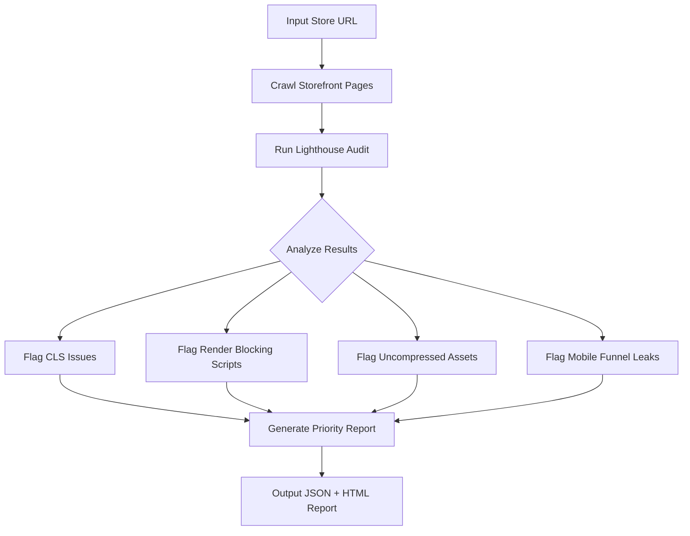

# Shopify Performance Auditor


A diagnostic script that crawls Shopify storefronts and flags CLS issues, render blocking scripts, uncompressed assets, and mobile funnel leaks killing your conversion rate. Built for growth engineers who need data before they touch code.

---

## The Problem This Solves

Most developers guess where a store is slow. They install a speed app, run one Lighthouse test, and call it done. Real performance engineering starts with systematic diagnosis. This auditor crawls your entire storefront, maps every bottleneck, and outputs a prioritized fix list with the exact file causing each issue.

---

## Architecture



---

## Audit Checks

| Check | Description | Impact |
|---|---|---|
| Cumulative Layout Shift | Detects elements causing page jumps | High |
| Render Blocking Scripts | Flags JS blocking page paint | High |
| Uncompressed Images | Finds oversized image assets | Medium |
| Mobile PageSpeed | Full mobile Lighthouse score | High |
| Third Party Scripts | Maps external script overhead | Medium |
| Time to First Byte | Server response speed check | High |
| Largest Contentful Paint | Hero image and font load time | High |

---

## Sample Audit Output

```json
{
  "store": "example-store.myshopify.com",
  "audit_date": "2026-05-31",
  "mobile_score": 42,
  "desktop_score": 71,
  "issues": [
    {
      "type": "render_blocking",
      "severity": "high",
      "file": "app.js",
      "recommendation": "Add defer attribute to script tag"
    },
    {
      "type": "cls",
      "severity": "high",
      "element": ".product-image",
      "recommendation": "Add explicit width and height attributes"
    },
    {
      "type": "uncompressed_image",
      "severity": "medium",
      "file": "hero-banner.jpg",
      "size_kb": 2400,
      "recommendation": "Convert to WebP and compress below 200kb"
    }
  ]
}
```

---

## Quick Start

```bash
git clone https://github.com/Waynelynx12/shopify-performance-auditor.git
cd shopify-performance-auditor
npm install
cp .env.example .env
node src/audit.js --url https://your-store.myshopify.com
```

---

## Environment Variables

| Variable | Description |
|---|---|
| STORE_URL | Target Shopify store URL |
| OUTPUT_FORMAT | json or html |
| MOBILE_ONLY | true to run mobile audit only |

---

## Built By

Sheriff Wayne, Growth Engineer and Shopify Technical Specialist. I run systematic performance audits on Shopify stores before touching a single line of code. Data first. Fix second.

